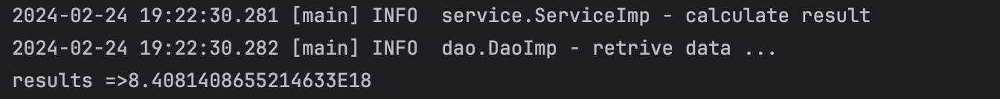
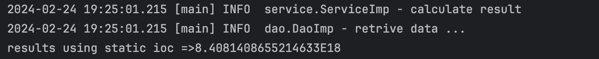
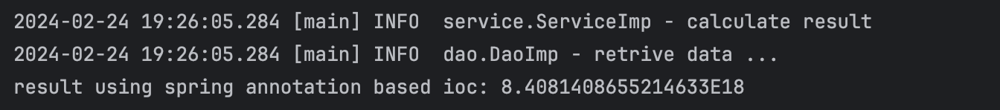

<h1>java IOC</h1>
<h2>project structure:</h2>
<ul>
    <li>src</li>
        <ul>
            <li>java</li>
                <ul>
                    <li>config</li>
                    <ul>
                       <li>config.txt</li> 
                    </ul>  
                    <li>dao</li>
                    <ul>
                       <li>IDao</li> 
                       <li>DaoImp</li> 
                    </ul> 
                    <li>service</li>
                        <ul>
                            <li>Iservice</li> 
                            <li>ServiceImp</li> 
                        </ul> 
                    <li>view</li>
                        <ul>
                            <li>DynamicIOCView</li> 
                            <li>StaticIOCView</li> 
                            <li>SpringAnotationBasedIOCView</li> 
                            <li>SpringXMLBasedIOCView</li> 
                        </ul> 
                </ul>
        </ul>
</ul>

<h2>class diagram:</h2>

<h2>Output:</h2>
<h3>dynamic ioc output:</h3>

<h3>static ioc output:</h3>

<h3>spring xml based  ioc output:</h3>

<h3>spring annotation based ioc output:</h3>

